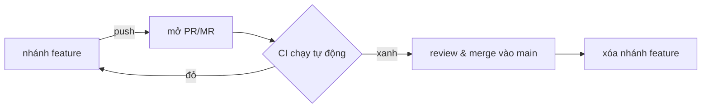

# Hướng dẫn Git & Pull/Merge Request (cho người mới)

Tài liệu này bổ trợ Buổi 8 (CI/CD). Nếu bạn chưa quen Git branch & Pull Request, đọc từ trên xuống.

> Thuật ngữ: **Pull Request (PR)** = tên của GitHub · **Merge Request (MR)** = tên của GitLab. **Cùng một
> khái niệm**: đề nghị gộp thay đổi từ một nhánh vào nhánh chính, có CI tự chạy và có chỗ review trước khi merge.

---

## 0. Vì sao cần?

Không dùng nhánh + PR nghĩa là commit thẳng lên `main` → dễ đẩy code lỗi vào "bản chính". PR tạo một **cửa
kiểm soát**: CI tự chạy (lint/test), người khác (hoặc chính bạn) xem lại, rồi mới gộp. `main` luôn ở trạng
thái deploy được.



---

## 1. Chuẩn bị một lần

```bash
# Fork repo khóa học trên GitHub về tài khoản của bạn (nút Fork), rồi clone bản fork:
git clone https://github.com/<tai-khoan-cua-ban>/dataops-masterclass.git
cd dataops-masterclass
git config user.name  "Ten Cua Ban"
git config user.email "hauct@vng.com.vn"
```

---

## 2. Vòng lặp làm việc hằng ngày

```bash
# 1) Tạo nhánh feature từ main (đừng làm việc thẳng trên main)
git switch -c feat/them-test-reconcile     # hoặc: git checkout -b feat/...

# 2) Sửa code... rồi xem mình đã đổi gì
git status
git diff

# 3) Chạy CI ở LOCAL trước khi commit (đỡ đẩy code đỏ lên)
make ci

# 4) Đưa thay đổi vào commit (theo Conventional Commits)
git add tests/test_reconcile.py
git commit -m "test: them test reconciliation phat hien lech du lieu"

# 5) Đẩy nhánh lên GitHub
git push -u origin feat/them-test-reconcile
```

---

## 3. Mở Pull Request (PR/MR)

Sau khi `git push`, terminal in ra một link "Create a pull request". Hoặc:

1. Vào repo trên GitHub → tab **Pull requests** → **New pull request**.
2. **base** = `main` (nhánh đích), **compare** = `feat/...` (nhánh của bạn).
3. Viết tiêu đề + mô tả ngắn: *đã đổi gì, vì sao, đã test ra sao*.
4. **Create pull request**.

Ngay lúc này **CI (GitHub Actions) tự chạy** — đúng workflow ở `.github/workflows/ci.yml`. Bạn thấy dấu ✓
(xanh) hay ✗ (đỏ) ngay trong PR.

- CI **đỏ** → sửa tiếp trên nhánh, `git push` lại → PR tự cập nhật & CI chạy lại. Không cần mở PR mới.
- CI **xanh** → review → bấm **Merge pull request** → thường **Squash and merge** cho gọn lịch sử.
- Merge xong → **Delete branch** cho sạch.

> Học một mình vẫn tập PR được: PR từ nhánh `feat/...` của bạn vào `main` của **chính fork của bạn**. CI vẫn
> chạy, bạn tự review & merge — đủ để quen quy trình.

---

## 4. Đồng bộ & rollback

```bash
# Sau khi merge, cập nhật main ở máy
git switch main
git pull

# Rollback an toàn nếu một commit đã merge gây lỗi (GitOps, buổi 8):
git revert <ma-commit-hong>    # tạo commit ĐẢO NGƯỢC, giữ nguyên lịch sử
git push
# -> mở PR cho commit revert này (hoặc push thẳng nếu quy ước cho phép) -> CI xanh -> merge
```

`git revert` khác `git reset --hard`: revert **thêm** một commit đảo ngược (an toàn trên nhánh chung, không
mất lịch sử); reset **xóa** lịch sử (nguy hiểm khi người khác đã pull).

---

## 5. Vài lệnh Git hay dùng

| Lệnh | Ý nghĩa |
|------|---------|
| `git status` | Xem file nào đã đổi/staged |
| `git diff` | Xem chi tiết thay đổi chưa commit |
| `git switch -c <nhánh>` | Tạo & chuyển sang nhánh mới |
| `git switch <nhánh>` | Chuyển nhánh |
| `git add <file>` / `git add -p` | Đưa file vào staging (`-p` chọn từng đoạn) |
| `git commit -m "..."` | Tạo commit |
| `git push -u origin <nhánh>` | Đẩy nhánh lần đầu |
| `git log --oneline -10` | Xem 10 commit gần nhất |
| `git restore <file>` | Bỏ thay đổi chưa commit của file |

---

## 6. Lỗi thường gặp

- **"updates were rejected"** khi push: nhánh trên remote mới hơn → `git pull --rebase` rồi push lại.
- **Merge conflict**: Git đánh dấu `<<<<<<<`/`>>>>>>>` trong file → sửa tay giữ phần đúng, `git add`, tiếp tục.
- **Lỡ commit lên main**: tạo nhánh từ chỗ đó (`git switch -c feat/x`), rồi đưa main về trước (`git reset --hard origin/main`) — cẩn thận.
- **Lỡ commit secret**: xóa khỏi code chưa đủ (lịch sử vẫn còn) → phải xoay (rotate) secret đó ngay + dùng công cụ dọn lịch sử. Tốt nhất là để `scan_secrets.py`/CI chặn từ đầu (buổi 7, 8).
