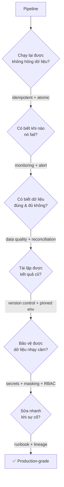

# Buổi 1 — Tư duy DataOps & Nguyên lý vận hành

**Ngày 09/07 · 20h–22h**

> Buổi này không viết nhiều code. Mục tiêu là **cài lại "hệ điều hành trong đầu"**: từ tư duy "miễn là
> chạy ra số" của Data Engineer sang tư duy "chạy ra số **đúng, đủ, và lặp lại được** kể cả khi có sự cố"
> của DataOps. Đây là nền tảng cho toàn bộ 10 buổi sau.

## Mục tiêu buổi học

Kết thúc buổi 1, bạn sẽ:

- Phân biệt rõ **DataOps vs Data Engineer (DE) vs Data Analyst (DA)** và biết mình đang đứng ở đâu.
- Hiểu vì sao **reliability** là sống còn — nhất là với dữ liệu tài chính/giao dịch.
- Nắm 4 nguyên lý nền tảng dùng xuyên suốt khóa: **idempotency, atomicity, reproducibility, reconciliation**.
- Biết thế nào là một pipeline "chuẩn production" và chỉ ra được điểm rủi ro của một pipeline cho trước.
- Dựng xong môi trường thực hành (Docker) và khởi tạo repo cá nhân theo cấu trúc khóa học.

---

## 1. DataOps là gì?

**DataOps** = áp dụng tư duy và thực hành của **DevOps + SRE (Site Reliability Engineering) + Agile** vào
**vòng đời dữ liệu**. Nói ngắn gọn: *coi pipeline dữ liệu như một sản phẩm phần mềm chạy production* — phải
được version control, test, tự động hóa, giám sát, và vận hành có kỷ luật.

DataOps **không phải** một công cụ. Không có "phần mềm DataOps" để cài. Nó là một **tập hợp nguyên lý + thực
hành** mà bạn áp lên stack dữ liệu sẵn có (Airflow, Spark, warehouse...).

### Ba trụ cột

1. **Automation** — tự động hóa từ ingest → transform → test → deploy, giảm thao tác tay (nguồn gốc của lỗi).
2. **Observability** — luôn "nhìn thấu" được pipeline: nó chạy chưa, chạy đúng chưa, dữ liệu có tươi & sạch không.
3. **Reliability** — pipeline chạy đúng kể cả khi có sự cố (input trễ, máy chết giữa chừng, chạy lại...).

---

## 2. DataOps vs Data Engineer vs Data Analyst

Ranh giới hay gây nhầm. Cách dễ nhớ: **DA hỏi "số nói lên điều gì?", DE hỏi "làm sao có số?", DataOps hỏi
"làm sao số luôn đúng & hệ thống luôn sống?"**

| Tiêu chí | Data Analyst (DA) | Data Engineer (DE) | DataOps Engineer |
|----------|-------------------|--------------------|------------------|
| Câu hỏi chính | Dữ liệu *nói gì*? | Làm sao *xây* được pipeline? | Làm sao pipeline *luôn đáng tin & vận hành tốt*? |
| Output | Dashboard, báo cáo, insight | Pipeline ETL/ELT, data model | Pipeline reliable + CI/CD + monitoring + runbook |
| Quan tâm | Business logic, trực quan hóa | Schema, transform, performance | Idempotency, SLA, alert, security, incident response |
| Ví dụ công cụ | SQL, Looker, Power BI | Spark, dbt, Airflow | Airflow + Prometheus + GX + CI/CD + secrets mgmt |
| Khi pipeline lỗi lúc 3h sáng | Không phải việc của họ | "Mai sửa" | **Là người được gọi dậy** 📟 |

Trong thực tế (đặc biệt ở công ty nhỏ) một người có thể kiêm nhiều vai. Nhưng **tư duy DataOps là thứ
nâng giá trị của bạn lên** — vì nó là thứ khó tự học nhất và đắt giá nhất khi hệ thống ở quy mô lớn.

> **Vì sao điều này giúp bạn cạnh tranh việc làm (2026):** thị trường đang dịch chuyển từ "tuyển người xây
> pipeline" sang "tuyển người vận hành data platform đáng tin cậy". Các JD DataOps 2026 nhấn mạnh
> *reliability engineering, observability, data contracts, SLO/SLI, FinOps*. Một DE biết những điều này nổi
> bật hơn hẳn DE thuần. (Nguồn: Atlan — DataOps Engineer Skills 2026.)

---

## 3. Vì sao reliability quan trọng — đặc biệt với dữ liệu tài chính

Với dữ liệu marketing, sai 2% có thể chấp nhận. Với **dữ liệu giao dịch/tài chính, sai 1 đồng là sai** —
ảnh hưởng tới đối soát, báo cáo cho cơ quan quản lý, và niềm tin.

Một vài kiểu "sự cố thầm lặng" mà pipeline không reliable hay gặp:

- **Nhân đôi dữ liệu (double-counting):** job chạy lại sau khi fail → doanh thu báo cáo gấp đôi thực tế.
- **Mất dữ liệu (silent data loss):** một file đến trễ bị bỏ qua, không ai biết → thiếu giao dịch.
- **Dữ liệu nửa vời (partial write):** job chết giữa chừng → bảng có 60% dữ liệu, downstream tưởng là đủ.
- **Sai lệch không ai phát hiện:** không có reconciliation → lệch tích lũy nhiều ngày mới bị phát hiện.

**Cái giá thật:** không chỉ là sửa số. Là **mất niềm tin** — một khi sếp/đối tác bắt được dashboard sai một
lần, họ sẽ nghi ngờ *mọi* con số bạn đưa ra. Reliability là cách bạn bảo vệ niềm tin đó.

> 💬 **Case study thảo luận trên lớp:** một pipeline doanh thu ngân hàng chạy lúc 1h sáng. Đêm đó nguồn dữ
> liệu đến trễ 40 phút; job đầu tiên chạy với dữ liệu thiếu, báo "thành công"; vận hành thấy thiếu nên chạy
> lại job → INSERT chồng lên dữ liệu cũ → doanh thu sáng hôm sau gấp ~1.7 lần. *Chuyện gì đã sai? Sửa từ
> nguyên lý nào?* (Gợi ý: idempotency + reconciliation + sensor chờ dữ liệu đủ.) Ta sẽ mổ xẻ ở lab.

---

## 4. Bốn nguyên lý nền tảng (dùng cả khóa)

### 4.1. Idempotency (tính lũy đẳng)

> Chạy một thao tác **nhiều lần** cho **cùng kết quả** như chạy **một lần**.

Đây là nguyên lý **quan trọng nhất** của DataOps. Vì sao? Vì trong production, pipeline **sẽ** chạy lại:
retry tự động, backfill, vận hành chạy tay khi nghi ngờ. Nếu chạy lại làm hỏng dữ liệu, bạn không bao giờ
dám chạy lại → mọi sự cố đều thành thảm họa thủ công.

Ví dụ kinh điển — **không idempotent**:

```sql
-- ❌ Chạy 2 lần = dữ liệu gấp đôi
INSERT INTO daily_revenue
SELECT order_date, SUM(amount) FROM orders WHERE order_date = '2026-07-09';
```

Phiên bản **idempotent** (xóa-rồi-ghi theo partition, hoặc MERGE/upsert):

```sql
-- ✅ Chạy bao nhiêu lần cũng ra cùng kết quả
DELETE FROM daily_revenue WHERE order_date = '2026-07-09';
INSERT INTO daily_revenue
SELECT order_date, SUM(amount) FROM orders WHERE order_date = '2026-07-09';
```

Mẹo nhận biết: nếu thao tác ghi của bạn dùng `INSERT` thuần mà không có cơ chế "ghi đè theo khóa/partition"
thì gần như chắc chắn **không** idempotent.

### 4.2. Atomicity (tính nguyên tử)

> Thao tác hoặc **thành công trọn vẹn**, hoặc **không để lại gì** — không có trạng thái nửa vời.

Nếu job ghi 1 triệu dòng mà chết ở dòng 600k, bạn **không** muốn downstream đọc được 600k dòng đó tưởng là
đủ. Cách đạt atomicity: ghi vào bảng/thư mục tạm (staging) rồi **swap** một phát khi xong; hoặc dùng
transaction (SQL) / table format có ACID như Delta (Lakehouse — buổi 5).

### 4.3. Reproducibility (tính tái lập)

> Cùng input + cùng code + cùng môi trường → **cùng output**, ở bất kỳ thời điểm/máy nào.

Đây là lý do ta **pin version** (Docker, requirements.txt), dùng **Git** cho code, và tránh logic phụ thuộc
"giờ chạy thực tế" (`now()`) thay vì mốc thời gian của dữ liệu (logical/execution date). Một pipeline không
reproducible là pipeline không debug được: "trên máy tôi chạy đúng mà" 🤷.

### 4.4. Reconciliation (đối soát)

> Tự động so sánh **nguồn vs đích** để khẳng định dữ liệu **đúng & đủ**.

Ví dụ: sau khi nạp, kiểm tra `COUNT(*)` và `SUM(amount)` ở bảng đích **khớp** với nguồn (trong ngưỡng cho
phép). Nếu lệch → dừng pipeline & cảnh báo, **đừng** để dữ liệu lệch chảy xuống dashboard. Với dữ liệu tài
chính, reconciliation gần như **bắt buộc**.

```
nguồn:  COUNT = 10,000  | SUM(amount) = 1,250,400,000
đích:   COUNT = 10,000  | SUM(amount) = 1,250,400,000   ✅ khớp → cho qua
đích:   COUNT =  9,998  | SUM(amount) = 1,249,900,000   ❌ lệch → dừng + alert
```

---

## 5. Thế nào là một pipeline "chuẩn production"?

Một pipeline production-grade khác pipeline "chạy trên laptop" ở chỗ nó trả lời được **mọi** câu hỏi sau:



Một checklist gọn để đánh giá bất kỳ pipeline nào (ta sẽ dùng ở lab):

- [ ] Chạy lại an toàn? (idempotent + atomic)
- [ ] Có test dữ liệu trước khi xuống hạ nguồn? (data quality)
- [ ] Có đối soát nguồn↔đích? (reconciliation)
- [ ] Có cảnh báo khi fail / khi dữ liệu sai? (monitoring + alert)
- [ ] Code trong Git, môi trường pin version? (reproducibility)
- [ ] Secrets không nằm trong code? PII được che? (security)
- [ ] Có runbook & truy được nguồn gốc lỗi? (incident readiness)

> Mỗi gạch đầu dòng ở trên chính là **một buổi học** trong khóa. Buổi 1 chỉ cần bạn *nhìn ra* được pipeline
> thiếu gì; các buổi sau dạy *cách vá*.

---

## 6. Tổng quan tech stack & lộ trình khóa học

Toàn bộ khóa chạy **local bằng Docker** — không cần cloud. (Chi tiết version: [`docs/tech-stack.md`](../../docs/tech-stack.md).)

| Lớp | Công cụ | Học ở buổi |
|-----|---------|-----------|
| Orchestration | Apache Airflow 3 | 2, 3 |
| DWH (stack SQL) | PostgreSQL | 4 |
| Lakehouse (stack Spark) | PySpark + Delta Lake + MinIO | 5, 6 |
| Security | secrets, masking PII, RBAC | 7 |
| CI/CD | GitHub Actions + Docker | 8 |
| Monitoring & DQ | Prometheus + Grafana + Great Expectations | 9 |
| Incident & DR | lineage, runbook, RTO/RPO | 10 |
| Final project | tất cả | 11 |

**Bản đồ tư duy:** buổi 1 cho bạn *nguyên lý* → buổi 2–3 cho bạn *công cụ điều phối* (Airflow) → buổi 4–5
cho bạn *2 stack vận hành* (DWH & Lakehouse) → buổi 6–10 cho bạn *các kỹ năng vận hành quanh pipeline*
(tối ưu, bảo mật, CI/CD, giám sát, sự cố) → buổi 11 *ghép tất cả thành portfolio*.

---

## 7. Chuẩn bị cho buổi thực hành

Sang [`lab/README.md`](./lab/) để:

1. Cài Docker & dựng môi trường khóa học.
2. Khởi tạo Git repo cá nhân theo cấu trúc dự án.
3. Phân tích một pipeline có sẵn (`lab/pipeline_risky.py`) và chỉ ra các điểm rủi ro theo checklist mục 5.

Sau buổi học: làm [`exercises.md`](./exercises.md) và tự chấm bằng [`checklist.md`](./checklist.md).

---

## Tài liệu tham khảo (chuẩn hóa kiến thức)

- DataOps Manifesto — https://dataopsmanifesto.org/
- Google SRE Book (chương về reliability, toil, incident) — https://sre.google/books/
- Apache Airflow 3 GA — https://airflow.apache.org/blog/airflow-three-point-oh-is-here/
- DataOps Engineer Skills 2026 (Atlan) — https://atlan.com/dataops-engineer-skills/
- "Reproducibility & idempotency in data pipelines" — khái niệm nền của khóa.
