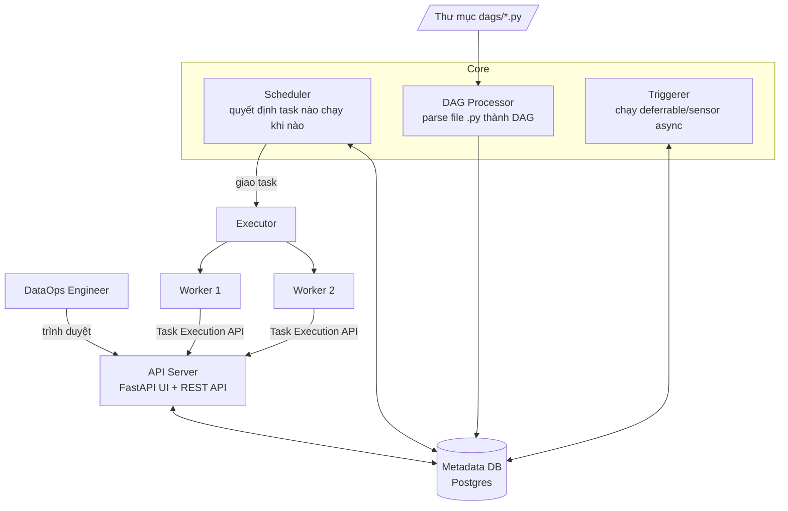
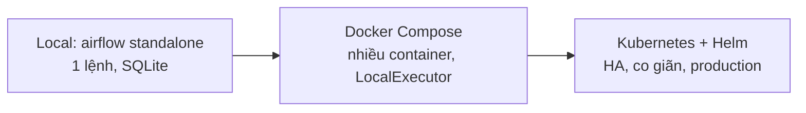

# Buổi 2 — Apache Airflow 3: Kiến trúc & Triển khai

**Ngày 13/07 · 20h–22h · Bật stack: `make up`**

> Buổi 1 cho bạn *nguyên lý*. Từ buổi 2, ta có *công cụ* để hiện thực hóa chúng. Airflow là "nhạc trưởng"
> điều phối toàn bộ pipeline trong khóa. Buổi này tập trung **hiểu kiến trúc** (để sau này debug & vận hành
> được) và **các cách triển khai** — chưa đi sâu viết DAG (đó là buổi 3).

## Mục tiêu buổi học

- Hiểu Airflow là gì, vai trò của nó trong DataOps, và khi nào **không** nên dùng.
- Nắm vững các **thành phần** của Airflow và cách chúng phối hợp (để biết khi lỗi thì nhìn vào đâu).
- Phân biệt các loại **Executor** (Local / Celery / Kubernetes) và biết chọn cái nào.
- Hiểu các **hướng triển khai** (local Docker → Docker Compose → Kubernetes/Helm) và ưu/nhược.
- Nắm khái niệm **HA & GitOps** cho Airflow.
- Biết những điểm **mới & quan trọng ở Airflow 3** so với Airflow 2.

---

## 1. Airflow là gì & vai trò trong DataOps

**Apache Airflow** là nền tảng **orchestration** (điều phối) workflow dạng code: bạn khai báo các *việc cần
làm* và *thứ tự phụ thuộc* giữa chúng bằng Python, Airflow lo việc **lên lịch, chạy, retry, theo dõi, ghi log**.

Triết lý cốt lõi: **"workflows as code"** (pipeline là code). Điều này khớp hoàn hảo với DataOps — vì code
thì version-control được, review được, test được, tái lập được (nguyên lý reproducibility ở buổi 1).

Airflow **không phải**:
- Không phải công cụ xử lý dữ liệu (nó *điều phối* Spark/SQL chạy, chứ bản thân không nên xử lý dữ liệu lớn).
- Không phải hệ thống streaming real-time (Airflow hợp với **batch/scheduled**; real-time dùng Kafka/Flink).
- Không phải nơi truyền khối dữ liệu lớn giữa các task (XCom chỉ để truyền *metadata nhỏ* — buổi 3).

> **Quy tắc vàng:** Airflow là *nhạc trưởng*, không phải *nhạc công*. Nó ra lệnh "Spark, chạy job này đi",
> chứ không tự mình bê 1TB dữ liệu vào RAM của worker.

### Khái niệm nền (chỉ điểm danh, đào sâu ở buổi 3)

- **DAG** (Directed Acyclic Graph): một workflow — tập task + quan hệ phụ thuộc, không có chu trình.
- **Task**: một đơn vị công việc trong DAG.
- **Operator**: "khuôn" định nghĩa một loại việc (PythonOperator, BashOperator, SQLExecuteQueryOperator...).
- **Run / Task Instance**: một lần chạy cụ thể của DAG/task tại một mốc thời gian.

---

## 2. Kiến trúc & các thành phần

Airflow là hệ **phân tán** gồm nhiều tiến trình phối hợp qua một **Metadata Database**. Hiểu sơ đồ này giúp
bạn biết "khi DAG không chạy thì soi component nào".



### Vai trò từng thành phần

| Thành phần | Nhiệm vụ | Khi nó "chết" thì sao |
|------------|----------|----------------------|
| **API Server** | Phục vụ Web UI (FastAPI, mới ở Airflow 3) + REST API; **mới:** là điểm trung gian giữa worker và DB | UI không vào được; task không cập nhật trạng thái được |
| **Scheduler** | Trái tim hệ thống: đọc DAG, quyết định task nào đủ điều kiện chạy, đẩy vào executor | DAG không được lên lịch, không có task mới chạy |
| **DAG Processor** | Parse file `.py` trong thư mục `dags/` thành đối tượng DAG, ghi vào DB | DAG mới/sửa không xuất hiện hoặc không cập nhật |
| **Executor** | Cơ chế *quyết định task chạy ở đâu & thế nào* (xem mục 3) | Task bị kẹt ở trạng thái `queued` |
| **Worker** | Tiến trình thực sự *chạy* code task | Task không được thực thi |
| **Triggerer** | Chạy các **deferrable operator / sensor** kiểu async (chờ sự kiện mà không chiếm slot worker) | Sensor async/deferred bị treo |
| **Metadata DB** | "Nguồn sự thật": lưu trạng thái mọi DAG run, task, connection, variable... | Toàn hệ thống dừng |

> 💡 **Mẹo debug (rất hay dùng khi đi làm):** DAG không xuất hiện → soi **DAG Processor**. DAG có nhưng
> không chạy → soi **Scheduler**. Task `queued` mãi không `running` → soi **Executor/Worker**. UI lỗi →
> soi **API Server**. Trạng thái loạn → soi **Metadata DB**.

### Cấu trúc thư mục (trong repo khóa học)

```
dags/            # file DAG (.py) — DAG Processor quét ở đây  ← mount vào container
data/            # dữ liệu dùng chung                          ← mount vào container
logs/            # log task (volume riêng)
infra/airflow/   # Dockerfile + requirements cho image
docker-compose.yml  # khai báo các service ở trên
```

Trong khóa, ta dùng **LocalExecutor** + 1 Postgres metadata DB (xem `docker-compose.yml`). Đủ để học, nhẹ
cho laptop.

---

## 3. Executor — task chạy ở đâu?

Executor là lựa chọn kiến trúc **quan trọng nhất** khi triển khai Airflow. Nó quyết định khả năng mở rộng.

| Executor | Cách chạy task | Ưu | Nhược | Dùng khi |
|----------|----------------|-----|-------|----------|
| **SequentialExecutor** | Tuần tự, 1 task/lúc (SQLite) | Đơn giản nhất | Không song song; chỉ để thử | Demo nhanh, **không** production |
| **LocalExecutor** | Đa tiến trình trên **cùng 1 máy** | Đơn giản, đủ mạnh cho quy mô vừa | Giới hạn bởi 1 máy; không HA worker | **Khóa học này**, team nhỏ/vừa |
| **CeleryExecutor** | Phân tán task tới **nhiều worker** qua message broker (Redis/RabbitMQ) | Mở rộng ngang, nhiều worker | Phải vận hành thêm broker + worker | Quy mô lớn, nhiều DAG song song |
| **KubernetesExecutor** | Mỗi task chạy trong **1 pod K8s riêng** | Cô lập tốt, co giãn theo nhu cầu, tiết kiệm khi nhàn rỗi | Cần K8s; overhead khởi tạo pod | Hạ tầng đã có K8s, workload biến động |

> Có thể trộn: **CeleryKubernetesExecutor**. Airflow 3 còn có **EdgeExecutor** cho chạy task ở xa/biên.

**Cách chọn (rule of thumb):** bắt đầu bằng **LocalExecutor**; khi 1 máy không đủ → **Celery**; khi đã sống
trong hệ sinh thái **Kubernetes** → **KubernetesExecutor** để tận dụng co giãn & cô lập.

---

## 4. Các hướng triển khai



| Hướng | Mô tả | Hợp với | Hạn chế |
|-------|-------|---------|---------|
| **Local / standalone** | `airflow standalone` — tất cả trong 1 tiến trình, SQLite | Thử nghiệm cá nhân, học khái niệm | Không song song, không bền |
| **Docker Compose** | Mỗi component 1 container; metadata DB là Postgres | **Khóa học**, dev team, PoC | Vẫn bó trong 1 host; không tự co giãn |
| **Kubernetes + Helm** | Dùng [official Helm chart](https://airflow.apache.org/docs/helm-chart/stable/index.html); scheduler/worker/triggerer là deployment riêng | Production thật, quy mô lớn | Cần kỹ năng K8s; vận hành phức tạp hơn |

Trong khóa ta dùng **Docker Compose** (`make up`). Buổi này sẽ **xem demo** Airflow chạy trên **Minikube
(K8s local) qua Helm** để bạn hình dung production — không bắt buộc tự dựng.

### Demo K8s (quan sát)

```bash
# (Chỉ xem demo trên lớp — không bắt buộc chạy)
minikube start --memory=6g
helm repo add apache-airflow https://airflow.apache.org
helm install airflow apache-airflow/airflow --namespace airflow --create-namespace
kubectl get pods -n airflow      # thấy scheduler, api-server, worker, triggerer là các pod riêng
```

Điểm cần *thấy*: trên K8s, mỗi thành phần là một workload độc lập, **co giãn & tự hồi phục** được — đó là
nền của tính HA ở mục sau.

---

## 5. High Availability (HA) & GitOps

### HA — không có điểm chết đơn lẻ (single point of failure)

- **Scheduler HA:** từ Airflow 2.0, có thể chạy **nhiều scheduler active-active** cùng lúc — một con chết,
  con khác gánh tiếp, không gián đoạn lên lịch.
- **Metadata DB HA:** dùng Postgres có replica/failover (vd: managed RDS, Patroni).
- **Worker HA:** nhiều worker (Celery) hoặc pod tự tái tạo (K8s).
- **Kết quả:** pipeline vẫn chạy kể cả khi một thành phần gặp sự cố → đúng tinh thần *reliability* buổi 1.

### GitOps cho Airflow

> **Nguyên tắc:** Git là "nguồn sự thật" duy nhất. DAG & cấu hình chỉ thay đổi qua commit, không sửa tay trên server.

Luồng GitOps điển hình: DAG nằm trong Git → CI test (buổi 8) → khi merge, DAG được **đồng bộ** vào Airflow
(qua git-sync sidecar trên K8s, hoặc build vào image, hoặc CI push). Lợi ích: mọi thay đổi có lịch sử,
review được, rollback được. Ta sẽ dựng luồng này ở **buổi 8 (CI/CD)**.

---

## 6. Có gì mới & quan trọng ở Airflow 3?

Khóa học dùng **Airflow 3** (image `apache/airflow:3.0.6`). Vài thay đổi lớn so với Airflow 2 mà bạn nên biết:

- **UI viết lại hoàn toàn** bằng React + **FastAPI** → nhanh, hiện đại; "Webserver" nay là **API Server**.
- **DAG Versioning:** mỗi DAG run gắn với *phiên bản DAG* lúc bắt đầu. Sửa DAG giữa chừng **không** làm hỏng
  run đang chạy — cực kỳ quan trọng cho reproducibility & debug.
- **Task Execution API (AIP-72):** worker **không còn nói chuyện trực tiếp với Metadata DB** mà qua API
  Server → kiến trúc client–server, an toàn hơn, mở đường cho **đa ngôn ngữ** (Task SDK; bắt đầu có Go).
- **Scheduling hướng sự kiện / Assets:** thay cho "Dataset" cũ — DAG có thể được kích hoạt khi một *asset*
  (vd: file/bảng) được cập nhật, không chỉ theo lịch. (Đào sâu ở buổi 3.)
- **Backfill được quản lý bởi scheduler** (tốt hơn, có UI) — liên quan trực tiếp buổi 3.
- Bỏ `schedule_interval` (dùng `schedule=`), bỏ SubDag, dọn nhiều API cũ.

> Vì sao điều này giúp bạn cạnh tranh: nhiều tổ chức đang **migrate 2 → 3** trong 2025–2026. Hiểu khác biệt
> kiến trúc khiến bạn hữu dụng ngay trong các dự án nâng cấp.

---

## 7. Sang phần thực hành

Ở [`lab/README.md`](./lab/): bạn sẽ deploy DAG đầu tiên vào Airflow vừa dựng, quan sát từng thành phần hoạt
động (scheduler bắt DAG, worker chạy task, đọc log), và so sánh trải nghiệm với kiến trúc ở mục 2.

Sau buổi học: [`exercises.md`](./exercises.md) + tự chấm [`checklist.md`](./checklist.md).

---

## Tài liệu tham khảo

- Airflow 3 GA — https://airflow.apache.org/blog/airflow-three-point-oh-is-here/
- Kiến trúc Airflow (docs) — https://airflow.apache.org/docs/apache-airflow/stable/core-concepts/overview.html
- Executors — https://airflow.apache.org/docs/apache-airflow/stable/core-concepts/executor/index.html
- Helm chart chính thức — https://airflow.apache.org/docs/helm-chart/stable/index.html
- Scheduler HA — https://airflow.apache.org/docs/apache-airflow/stable/administration-and-deployment/scheduler.html
