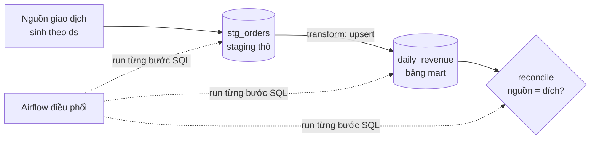

# Buổi 4 — SQL in DataOps — Stack Data Warehouse

**Ngày 20/07 · 20h–22h · Bật stack: `make up-warehouse`**

> Buổi 3 cho bạn cách viết DAG idempotent *ở tầng điều phối*. Buổi 4 áp dụng đúng các nguyên lý đó *bằng SQL*
> trên một **Data Warehouse** thật (PostgreSQL). Đây là stack phổ biến nhất trong doanh nghiệp — rất nhiều
> pipeline tài chính/báo cáo chạy hoàn toàn bằng SQL. Mục tiêu: viết SQL pipeline **chạy lại không nhân đôi**,
> có **reconciliation**, và được Airflow điều phối.

## Mục tiêu buổi học

- Viết SQL pipeline **reliable**: upsert/MERGE, partition overwrite — idempotent.
- Dùng **transaction** để đạt atomicity (toàn vẹn khi chạy lại / khi lỗi giữa chừng).
- Áp dụng **reconciliation** bằng SQL: đối soát nguồn ↔ đích.
- Quản lý **dependency giữa các bước SQL** bằng Airflow.
- Biết khi nào **DWH/SQL là đủ** (chưa cần Spark/Lakehouse).

---

## 1. Kiến trúc stack DWH trong buổi này



Mô hình 2 lớp tối giản nhưng đúng thực tế:
- **`stg_orders`** — lớp *staging*: dữ liệu thô của từng ngày (`order_date = ds`).
- **`daily_revenue`** — lớp *mart*: số liệu đã tổng hợp để báo cáo (1 dòng/ngày).

Toàn bộ chạy trong PostgreSQL (service `warehouse`, conn_id `warehouse` đã cấu hình sẵn).

---

## 2. SQL idempotent: hai kỹ thuật chủ lực

Nhắc lại buổi 1 & 3: pipeline **sẽ** chạy lại. SQL phải đảm bảo chạy lại không nhân đôi.

### 2.1. Partition overwrite (xóa-rồi-ghi) cho lớp staging

```sql
-- Idempotent: nạp lại ngày :ds luôn cho cùng kết quả
BEGIN;
DELETE FROM stg_orders WHERE order_date = :ds;   -- xóa partition của ngày
INSERT INTO stg_orders (order_id, order_date, customer_email, amount)
VALUES ...;                                       -- ghi lại dữ liệu ngày đó
COMMIT;
```

Bọc trong **transaction** (`BEGIN…COMMIT`) → atomic: hoặc cả `DELETE`+`INSERT` cùng thành công, hoặc rollback
(không để bảng ở trạng thái "đã xóa nhưng chưa ghi").

### 2.2. Upsert / MERGE cho lớp mart

Khi muốn "có thì cập nhật, chưa có thì thêm" — dùng **upsert**. Postgres có 2 cách:

```sql
-- Cách 1: INSERT ... ON CONFLICT (Postgres) — gọn, rất phổ biến
INSERT INTO daily_revenue (order_date, total_amount, order_count)
SELECT order_date, SUM(amount), COUNT(*)
FROM stg_orders WHERE order_date = :ds
GROUP BY order_date
ON CONFLICT (order_date)
DO UPDATE SET total_amount = EXCLUDED.total_amount,
              order_count = EXCLUDED.order_count;
```

```sql
-- Cách 2: MERGE (chuẩn SQL, Postgres 15+; nhiều DWH như BigQuery/Snowflake dùng cú pháp này)
MERGE INTO daily_revenue t
USING (
  SELECT order_date, SUM(amount) AS total_amount, COUNT(*) AS order_count
  FROM stg_orders WHERE order_date = :ds GROUP BY order_date
) s
ON t.order_date = s.order_date
WHEN MATCHED THEN UPDATE SET total_amount = s.total_amount, order_count = s.order_count
WHEN NOT MATCHED THEN INSERT (order_date, total_amount, order_count)
                      VALUES (s.order_date, s.total_amount, s.order_count);
```

Cả hai đều **idempotent**: chạy lại ngày `:ds` chỉ *cập nhật* dòng của ngày đó, không thêm trùng.

> **Khi nào dùng cái nào:** `ON CONFLICT` cần một **unique constraint/PK** trên khóa (ở đây `order_date`).
> `MERGE` linh hoạt hơn (nhiều điều kiện, cả DELETE) và là cú pháp *chuẩn hóa* giữa các DWH — học `MERGE`
> giúp bạn chuyển stack dễ hơn. Trong lab ta dùng `ON CONFLICT` (robust trên Postgres) và cho bạn cả file
> `MERGE` để tham khảo.

---

## 3. Reconciliation bằng SQL

Sau khi transform, **đối soát** mart với staging để chắc dữ liệu đúng & đủ:

```sql
-- Nguồn (staging) cho ngày :ds
SELECT COUNT(*) AS cnt, COALESCE(SUM(amount),0) AS total
FROM stg_orders WHERE order_date = :ds;

-- Đích (mart) cho ngày :ds
SELECT order_count AS cnt, total_amount AS total
FROM daily_revenue WHERE order_date = :ds;
```

Nếu `(cnt, total)` hai bên **không khớp** → pipeline **dừng + cảnh báo**, không để số liệu lệch xuống báo
cáo. Với dữ liệu tài chính, đây gần như là bước **bắt buộc** (buổi 1).

---

## 4. Quản lý dependency giữa các bước SQL

Thứ tự bắt buộc: `create_tables → load_staging → transform_upsert → reconcile`. Đừng để các bước "tự do" —
nếu `transform` chạy trước `load_staging` thì mart sẽ thiếu/sai dữ liệu.

Airflow lo việc này: mỗi bước là một task, nối phụ thuộc rõ ràng. Nếu một bước fail (vd: reconcile lệch),
các bước sau **không chạy**, và bạn biết ngay nhờ alert. Đây là điểm mạnh khi *điều phối SQL bằng Airflow*
thay vì chạy một file `.sql` khổng lồ bằng tay.

---

## 5. Khi nào DWH/SQL là đủ? (đừng over-engineer)

Rất nhiều người mới nghĩ "dữ liệu là phải Spark". Sai. **SQL trên DWH là đủ** khi:

- Dữ liệu vừa phải (đến hàng trăm triệu dòng vẫn ổn với DWH hiện đại như BigQuery/Snowflake/Redshift).
- Phép biến đổi diễn đạt tốt bằng SQL (join, aggregate, window).
- Đội ngũ mạnh SQL hơn Spark.

Chuyển sang **Lakehouse/PySpark** (buổi 5) khi: dữ liệu rất lớn / phi cấu trúc, cần xử lý ngoài khả năng
SQL, hoặc cần object storage rẻ + table format. *Chọn công cụ theo bài toán, không theo "mốt".* (Đây là tư
duy FinOps & "đủ tốt" sẽ nói kỹ ở buổi 6.)

---

## 6. Sang phần thực hành

Ở [`lab/README.md`](./lab/): bạn chạy DAG `session04_sql_dwh` điều phối 4 bước SQL trên warehouse, tự kiểm
chứng idempotency (chạy lại không nhân đôi), và thử làm "vỡ" reconciliation để thấy pipeline chặn lại.
File SQL nằm ở [`lab/sql/`](./lab/sql/).

Sau buổi: [`exercises.md`](./exercises.md) + [`checklist.md`](./checklist.md).

---

## Tài liệu tham khảo

- Postgres `INSERT ... ON CONFLICT` — https://www.postgresql.org/docs/current/sql-insert.html#SQL-ON-CONFLICT
- Postgres `MERGE` — https://www.postgresql.org/docs/current/sql-merge.html
- Transactions — https://www.postgresql.org/docs/current/tutorial-transactions.html
- Airflow Postgres provider — https://airflow.apache.org/docs/apache-airflow-providers-postgres/stable/index.html
