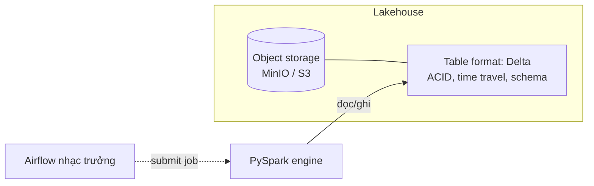

# Buổi 5 — PySpark in Modern Lakehouse

**Ngày 23/07 · 20h–22h · Bật stack: `make up-lakehouse`**

> Buổi 4 vận hành reliable trên DWH/SQL. Buổi 5 làm điều tương tự nhưng trên **Lakehouse**: PySpark +
> **table format Delta Lake** trên object storage. Mục tiêu không phải "học Spark từ A-Z" (đó là cả một
> khóa riêng) mà là **vận hành PySpark job một cách reliable**: idempotent, atomic, có reconciliation, và
> tận dụng ACID + time travel của Delta.

## Mục tiêu buổi học

- Hiểu **khi nào cần Lakehouse** (và khi nào DWH là đủ — nối tiếp buổi 4).
- Viết **PySpark job idempotent & retry-safe**: `replaceWhere`, partition overwrite an toàn.
- Hiểu vai trò **table format (Delta/Iceberg)**: ACID & time travel giúp pipeline an toàn.
- Đối soát (reconciliation) trên Lakehouse.
- Biết cách Airflow **điều phối** Spark job trong production (và vì sao không chạy Spark *trong* Airflow worker).

---

## 1. Khi nào cần Lakehouse?

**Data Lake** = object storage rẻ (S3/GCS/MinIO) chứa file thô (Parquet...). Vấn đề của lake "trần": không
có transaction, dễ hỏng khi ghi đồng thời, không time travel, schema lỏng lẻo.

**Lakehouse** = Data Lake + một **table format** (Delta/Iceberg/Hudi) phủ lên trên để có **ACID, time
travel, schema evolution** — tức là "chất lượng kiểu warehouse" trên "chi phí kiểu lake".

Chọn Lakehouse khi: dữ liệu **rất lớn** / phi cấu trúc, cần object storage rẻ, xử lý vượt khả năng SQL, hoặc
cần nhiều engine cùng đọc. Còn nếu dữ liệu vừa phải và SQL diễn đạt tốt → **DWH là đủ** (buổi 4). *Chọn theo
bài toán, không theo mốt.*



---

## 2. Stack Lakehouse trong buổi này

- **PySpark** (Spark 3.5) — engine xử lý, chạy trong **container `spark` riêng** (image đã có Java 17 + Spark).
- **Delta Lake 3.2** — table format (ACID, time travel).
- **MinIO** — object storage (S3-compatible). *Mặc định lab ghi Delta ra **filesystem local** (mount tại
  `data/lakehouse`) cho chắc chắn; phần MinIO/S3A là tùy chọn nâng cao ở cuối lab.*

> **Vì sao Spark ở container riêng, không nhét vào Airflow?** Nguyên tắc buổi 2: Airflow là *nhạc trưởng*,
> Spark là *nhạc công*. Chạy job Spark nặng *bên trong* worker Airflow sẽ làm nghẽn scheduler và khó co
> giãn. Trong production, Airflow **submit** job tới một Spark cluster / Kubernetes pod (mục 6).

> ⚠️ **Lần chạy đầu sẽ tải jar Delta từ Maven** (cần internet). Các lần sau dùng cache (volume `spark-ivy`),
> nhanh hơn nhiều.

---

## 3. PySpark job idempotent & retry-safe

Nhắc lại: job **sẽ** chạy lại (retry, backfill). Trên Delta, idempotency đạt được bằng **`replaceWhere`** —
ghi đè đúng "lát" dữ liệu (partition) của ngày, thay vì append mù.

```python
(df.write.format("delta")
   .mode("overwrite")
   .option("replaceWhere", f"order_date = '{ds}'")   # CHỈ thay partition của ngày ds
   .partitionBy("order_date")
   .save(ORDERS_PATH))
```

- Chạy lại cùng `ds` → Delta **thay thế** đúng partition đó, không nhân đôi. ✅ idempotent.
- Mỗi lần ghi là **một transaction ACID** → fail giữa chừng không để bảng nửa vời. ✅ atomic (không cần
  tự làm `.tmp`/rename như buổi 3 — table format lo việc đó).

> So sánh 3 stack về *cách đạt idempotency*: file thô (buổi 3) = ghi `.tmp` rồi rename; SQL/DWH (buổi 4) =
> DELETE+INSERT trong transaction / upsert; **Lakehouse (buổi 5) = `replaceWhere` trên Delta**. Cùng một
> nguyên lý, ba cách hiện thực.

### Retry-safe

Vì đã idempotent, bạn **bật retry thoải mái** ở tầng Airflow (buổi 3) mà không sợ hỏng dữ liệu. Đó chính là
lý do idempotency là "nguyên lý số 1".

---

## 4. Table format: ACID & Time Travel

Delta ghi một **transaction log** (`_delta_log/`) bên cạnh file Parquet. Nhờ đó:

- **ACID**: ghi đồng thời an toàn, không đọc phải dữ liệu nửa vời.
- **Time travel**: đọc lại dữ liệu ở phiên bản/thời điểm cũ.

```python
# Đọc phiên bản cũ
spark.read.format("delta").option("versionAsOf", 0).load(path)
spark.read.format("delta").option("timestampAsOf", "2026-06-20").load(path)

# Xem lịch sử
from delta.tables import DeltaTable
DeltaTable.forPath(spark, path).history().show()
```

Vì sao quan trọng cho vận hành: lỡ một job ghi sai, bạn **vẫn xem/khôi phục được** dữ liệu trước đó — một
"lưới an toàn" mà file thô không có. Đây là nền cho RESTORE & một phần disaster recovery (buổi 10).

### Delta vs Iceberg (biết để chọn)

Khoảng cách tính năng giữa **Delta** và **Iceberg** đã thu hẹp nhiều. Khác biệt còn lại chủ yếu là **hệ sinh
thái**: Delta gắn chặt Spark/Databricks; Iceberg trung lập engine hơn (nhiều catalog, nhiều engine đọc).
Bản mới (Delta 4 / Spark 4) thêm `VARIANT` cho semi-structured, **liquid clustering** thay partition cứng, và
**UniForm** (đọc bảng Delta như Iceberg/Hudi). Khóa dùng Delta 3.2 (ổn định, tài liệu nhiều); nguyên lý vận
hành áp dụng được cho cả Iceberg.

---

## 5. Reconciliation trên Lakehouse

Giống buổi 4: sau khi ghi, đọc lại từ Delta và đối soát số dòng / tổng tiền với nguồn. Lệch → dừng + cảnh báo.
Job `orders_delta_job.py` đã làm sẵn bước này.

---

## 6. Airflow điều phối Spark trong production

Local ta chạy job bằng `make spark-job` cho gọn. Trong **production**, Airflow *submit* job tới engine —
không chạy Spark trong worker. Hai mẫu phổ biến:

```python
# Mẫu 1: SparkSubmitOperator (Spark cluster standalone/YARN)
from airflow.providers.apache.spark.operators.spark_submit import SparkSubmitOperator
SparkSubmitOperator(task_id="orders", application="jobs/orders_delta_job.py",
                    conn_id="spark_default", application_args=["{{ ds }}"])

# Mẫu 2: KubernetesPodOperator (mỗi job 1 pod — cách mentor dùng trên K8s)
# Mỗi run tạo một pod Spark riêng -> cô lập & co giãn tốt.
```

Điểm cốt lõi cần nhớ: **dù submit kiểu gì, job vẫn phải idempotent** (mục 3) để retry/backfill an toàn. Tầng
điều phối thay đổi, nguyên lý vận hành thì không.

---

## 7. Sang phần thực hành

Ở [`lab/README.md`](./lab/): bạn chạy `orders_delta_job` ghi Delta, **tự kiểm chứng** chạy lại không nhân
đôi, mô phỏng job fail giữa chừng, và thử **time travel**. Phần cuối là tùy chọn dùng MinIO (object storage thật).
Code job: [`lab/jobs/`](./lab/jobs/).

Sau buổi: [`exercises.md`](./exercises.md) + [`checklist.md`](./checklist.md).

---

## Tài liệu tham khảo

- Delta Lake docs — https://docs.delta.io/latest/index.html
- Delta `replaceWhere` (selective overwrite) — https://docs.delta.io/latest/delta-batch.html#overwrite
- Time travel — https://docs.delta.io/latest/delta-batch.html#query-an-older-snapshot-of-a-table-time-travel
- Delta Lake 4.0 — https://delta.io/blog/delta-lake-4-0/
- Iceberg vs Delta — https://www.datacamp.com/blog/iceberg-vs-delta-lake
