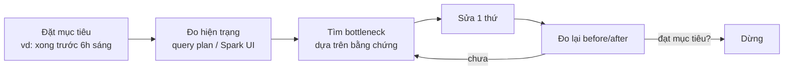

# Buổi 6 — Tối ưu hiệu năng & chi phí

**Ngày 27/07 · 20h–22h · Bật stack: `make up-lakehouse` (hoặc `make up-cluster`) + `make up-warehouse` khi cần phần SQL**

> Buổi 4–5 dạy *chạy đúng* (reliable). Buổi 6 dạy *chạy đủ nhanh với chi phí hợp lý*. Lưu ý thứ tự: **đúng
> trước, nhanh sau**. Một pipeline nhanh nhưng sai thì vô dụng. Mục tiêu buổi này là biết **tìm bottleneck
> dựa trên bằng chứng** (query plan, Spark UI) rồi tối ưu có đo lường — không "tối ưu theo cảm tính".

## Mục tiêu buổi học

- Có **tư duy tối ưu đúng**: đủ nhanh để đạt mục tiêu (SLA), không over-engineer.
- Đọc được **query plan** (DWH) và **Spark UI / `.explain()`** (Lakehouse) để tìm bottleneck.
- Nhận diện & xử lý 3 bottleneck phổ biến: **data skew, small-files, shuffle**.
- Dùng **partitioning, caching, broadcast join** đúng chỗ.
- Hiểu **FinOps** cơ bản: tối ưu chi phí cloud.

---

## 1. Tư duy tối ưu: đo trước, đừng đoán

Hai sai lầm kinh điển:
1. **Over-engineering**: tối ưu cái không phải bottleneck (vd cache lung tung) → tốn công, code phức tạp, không nhanh hơn.
2. **Tối ưu theo cảm tính**: "chắc là do join" → sửa mò.

Quy trình đúng:



> **Quy tắc vàng:** "đủ nhanh để đạt mục tiêu thì DỪNG". Tối ưu là để đạt SLA/chi phí, không phải để lập kỷ
> lục tốc độ. Mỗi lần tối ưu phải kèm **con số before/after** — nếu không đo được thì không gọi là tối ưu.

---

## 2. Đọc query plan (DWH)

Postgres (và mọi DWH) cho bạn xem *kế hoạch thực thi* một truy vấn:

```sql
EXPLAIN ANALYZE
SELECT order_date, SUM(amount) FROM stg_orders WHERE order_date = '2026-06-20' GROUP BY order_date;
```

Những thứ cần nhìn:
- **Seq Scan vs Index Scan**: `Seq Scan` (quét toàn bảng) trên bảng lớn + có điều kiện lọc → thường là dấu
  hiệu *thiếu index*. Thêm index phù hợp → `Index Scan`, nhanh hơn nhiều.
- **rows / cost**: ước lượng số dòng & chi phí; lệch nhiều so với thực tế (`actual rows`) → thống kê cũ (chạy `ANALYZE`).
- **Nested Loop vs Hash Join**: join sai chiến lược trên dữ liệu lớn → chậm.

> Trên các DWH cloud (BigQuery/Snowflake/Redshift), điều quan trọng nhất thường là **quét ít dữ liệu hơn** —
> vì bạn *trả tiền theo lượng dữ liệu quét*. Đó là cầu nối giữa hiệu năng và **chi phí** (mục 6).

---

## 3. Đọc Spark UI / `.explain()` (Lakehouse)

Với Spark, hai công cụ chính:

- **`df.explain(True)`**: in *physical plan* — xem join là `BroadcastHashJoin` hay `SortMergeJoin`, có
  `Exchange` (shuffle) ở đâu, có đọc thừa partition không.
- **Spark UI** (http://localhost:8085 nếu chạy cluster buổi 5, hoặc app UI cổng 4040): xem **Stages**,
  **tasks**, thời gian, dữ liệu shuffle, và **task lệch** (một task chạy lâu hơn hẳn = data skew).

Ba bottleneck phổ biến trên Spark:

| Bottleneck | Triệu chứng trên UI | Cách xử lý |
|-----------|---------------------|-----------|
| **Shuffle** (xáo trộn dữ liệu qua mạng khi join/groupBy) | Stage có `Exchange`, shuffle read/write lớn | Giảm shuffle: broadcast join, lọc sớm, repartition hợp lý |
| **Data skew** (một key chiếm phần lớn dữ liệu) | 1 task chạy lâu gấp nhiều lần các task khác | **Salting** (thêm hậu tố ngẫu nhiên vào key), AQE skew join |
| **Small files** (quá nhiều file nhỏ) | Rất nhiều task tí hon, overhead lớn | `coalesce`/`repartition` khi ghi; OPTIMIZE/compaction trên Delta |

---

## 4. Ba kỹ thuật tối ưu chủ lực

### 4.1. Broadcast join (khi một bảng NHỎ)

Khi join bảng lớn với bảng **nhỏ** (vd dim vài nghìn dòng), gửi (broadcast) bảng nhỏ tới mọi node → **bỏ
shuffle** của bảng lớn → nhanh hơn nhiều.

```python
from pyspark.sql.functions import broadcast
fact.join(broadcast(dim), "product_id")   # ép broadcast bảng dim nhỏ
```

(Spark tự broadcast nếu bảng dưới `spark.sql.autoBroadcastJoinThreshold`, mặc định 10MB; dùng hint khi cần chắc chắn.)

### 4.2. Partitioning & partition pruning

Chia dữ liệu theo cột hay lọc (vd `order_date`) → truy vấn lọc theo cột đó chỉ đọc **đúng partition cần**
(partition pruning), bỏ qua phần còn lại → quét ít hơn = nhanh + rẻ. Nhưng **đừng partition quá mịn** (vd theo
giờ khi dữ liệu nhỏ) → sinh small-files.

### 4.3. Caching (dùng đúng chỗ)

`df.cache()` giữ dữ liệu trong RAM để **tái sử dụng nhiều lần**. Chỉ cache khi một DataFrame được dùng lại ≥ 2
lần. Cache bừa → tốn RAM, có khi chậm hơn.

### 4.4. Small-files: gộp khi ghi

Ghi ra hàng nghìn file nhỏ → đọc lại rất chậm (overhead mở file + nhiều task). Gộp khi ghi:

```python
df.coalesce(4).write...      # giảm số file đầu ra
# Trên Delta: định kỳ chạy OPTIMIZE để compaction các file nhỏ.
```

---

## 5. Data skew & salting (nâng cao, biết để nhận diện)

Nếu một key (vd `customer_id = "VIP"`) chiếm 50% dữ liệu, task xử lý key đó sẽ "gánh" cả job → các node khác
chờ. Cách xử lý: **salting** — thêm hậu tố ngẫu nhiên vào key để rải đều, tổng hợp 2 bước. Spark 3+ có **AQE**
(Adaptive Query Execution) tự xử lý một phần skew join — bật `spark.sql.adaptive.enabled=true` (mặc định bật ở Spark 3.5).

---

## 6. FinOps — tối ưu chi phí cloud

Hiệu năng và chi phí là hai mặt của một đồng xu. Vài nguyên tắc FinOps cốt lõi (xu hướng tuyển dụng 2026):

- **Quét ít dữ liệu hơn**: partition pruning, chọn cột cần (tránh `SELECT *`), nén (Parquet) — giảm tiền quét
  trên DWH cloud.
- **Right-sizing**: cụm/warehouse đúng kích thước, đừng over-provision. Tắt khi không dùng (auto-suspend).
- **Autoscaling & spot/preemptible**: co giãn theo tải; dùng máy spot cho job chịu được gián đoạn → rẻ hơn nhiều.
- **Storage tiering & lifecycle**: chuyển dữ liệu cũ sang tầng lưu trữ rẻ; xóa dữ liệu tạm.
- **Theo dõi chi phí**: gắn tag, dashboard chi phí — "đo được mới quản được".

> **Tư duy DataOps:** tối ưu chi phí cũng cần *đo & có mục tiêu* như tối ưu tốc độ. "Đủ nhanh, đủ rẻ để đạt
> yêu cầu" là đích đến — không phải "nhanh nhất/rẻ nhất bằng mọi giá".

---

## 7. Sang phần thực hành

Ở [`lab/README.md`](./lab/): bạn (1) đọc query plan trên warehouse và tối ưu bằng index — đo before/after;
(2) chạy Spark demo thấy small-files vs gộp file, và broadcast join vs sort-merge qua `.explain()`. Code:
[`lab/jobs/`](./lab/jobs/) và [`lab/sql/`](./lab/sql/).

Sau buổi: [`exercises.md`](./exercises.md) + [`checklist.md`](./checklist.md).

---

## Tài liệu tham khảo

- Postgres `EXPLAIN` — https://www.postgresql.org/docs/current/sql-explain.html
- Spark SQL performance tuning — https://spark.apache.org/docs/latest/sql-performance-tuning.html
- Spark AQE — https://spark.apache.org/docs/latest/sql-performance-tuning.html#adaptive-query-execution
- Delta OPTIMIZE (compaction) — https://docs.delta.io/latest/optimizations-oss.html
- FinOps Foundation — https://www.finops.org/introduction/what-is-finops/
