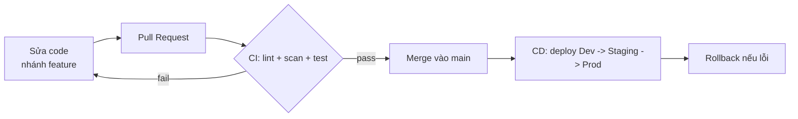

# Buổi 8 — CI/CD cho Data Pipeline

**Ngày 03/08 · 20h–22h · Cần: môi trường Python local (venv) + `make up` khi validate DAG**

> Đến giờ pipeline của bạn đã reliable, an toàn, tối ưu. Buổi 8 trả lời: làm sao **đưa thay đổi lên hệ thống
> mà không sợ vỡ**? Câu trả lời là CI/CD — tự động **lint + test** mỗi khi đổi code (CI) và tự động **triển
> khai** an toàn (CD). Đây là thứ biến "code chạy trên máy tôi" thành "code chạy tin cậy ở production".

## Mục tiêu buổi học

- Hiểu **git flow** và vì sao pipeline dữ liệu *cũng* cần CI/CD như phần mềm.
- Viết **test cho pipeline**: unit test (Python/SQL/Spark logic) & **data test**.
- Dựng **CI**: tự động lint + quét secret + test khi có thay đổi.
- Hiểu **CD**: tự động triển khai qua Dev/Staging/Prod, giảm rủi ro.
- Nắm **GitOps & rollback**: khôi phục nhanh khi deploy lỗi.

---

## 1. Vì sao pipeline dữ liệu cần CI/CD?

Pipeline là **code** (buổi 2: "workflows as code"). Mà code thì có bug, có regression. Không CI/CD nghĩa là:
sửa một DAG → push thẳng lên prod → 3h sáng pipeline vỡ → mất dữ liệu/niềm tin.

CI/CD dựng một **lưới an toàn tự động**: mỗi thay đổi phải *qua cửa kiểm tra* trước khi tới prod.



> Điểm khác so với phần mềm thường: pipeline dữ liệu còn cần **data test** (dữ liệu đúng không), không chỉ
> unit test (code đúng không). Ta test cả hai.

---

## 2. Git flow (gọn, đủ dùng)

- Làm việc trên **nhánh feature** (`hoc-vien/ten` hay `feat/xyz`), không commit thẳng lên `main`.
- Mở **Pull Request** → CI chạy tự động → review → merge.
- `main` luôn ở trạng thái *deploy được* (xanh).

Quy ước commit (đã nêu ở `CONTRIBUTING.md`): `feat:`, `fix:`, `test:`, `docs:`...

> 🆕 **Chưa quen Git branch / Pull Request (Merge Request)?** Đọc hướng dẫn từng bước cho người mới ở
> [`docs/git-workflow.md`](../../docs/git-workflow.md): tạo nhánh → commit → push → mở PR → CI chạy → merge → rollback.

---

## 3. Test cho pipeline

Bốn lớp test, từ nhanh/rẻ → chậm/đắt (kim tự tháp test):

| Lớp | Test gì | Ví dụ trong repo |
|-----|---------|------------------|
| **Unit test** | Logic thuần, không I/O | `tests/test_masking.py` (hàm masking) |
| **Logic/data test** | Tính đúng của biến đổi & **idempotency** | `tests/test_idempotency.py` (chạy lại không nhân đôi) |
| **DAG integrity** | DAG biên dịch/import được | `tests/test_dags_compile.py` + `make test-dags` (DagBag) |
| **Data quality test** | Dữ liệu *thực tế* đạt kỳ vọng | Great Expectations — **buổi 9** |

```python
# Ví dụ data/logic test: chạy lại cùng ngày KHÔNG nhân đôi (tests/test_idempotency.py)
def test_chay_lai_khong_nhan_doi(con):
    _run_day(con, "2026-06-20")
    first = ...
    _run_day(con, "2026-06-20")           # chạy lại
    assert rows == 1 and first == after   # idempotent
```

> Test idempotency là **đặc sản của DataOps**: nó chặn regression làm hỏng tính "chạy lại an toàn" — thứ
> khó phát hiện bằng mắt nhưng cực kỳ nguy hiểm ở production.

---

## 4. CI — tự động kiểm tra mỗi thay đổi

CI chạy một chuỗi cửa kiểm tra. Trong repo: [`.github/workflows/ci.yml`](../../.github/workflows/ci.yml) chạy
y hệt `make ci`:

1. **Lint** (`ruff check`) — code sạch, đúng chuẩn.
2. **Secret scan** (`scan_secrets.py` của buổi 7) — chặn secret hardcode.
3. **DAG compile** — bắt lỗi cú pháp DAG.
4. **Unit & data tests** (`pytest`) — logic & idempotency đúng.

Nếu **bất kỳ** bước nào fail → CI đỏ → **không merge được**. Đó là cách "shift-left": bắt lỗi *sớm*, rẻ.

```bash
make ci      # chạy đúng các bước CI ở local trước khi push -> đỡ đẩy code đỏ lên
```

---

## 5. CD — triển khai an toàn

**CD** = tự động đưa thay đổi (đã qua CI) lên môi trường. Nguyên tắc: đi qua **nhiều tầng** để giảm rủi ro:

```
Dev  ->  Staging (giống prod, dữ liệu mẫu)  ->  Production
```

Cách "deploy" pipeline tùy hạ tầng:
- DAG đóng vào **image** rồi roll-out (đã build ở buổi 2).
- **git-sync**: container kéo DAG mới từ Git (GitOps, buổi 2).
- Trong khóa (local): DAG được *mount*, chỉ cần nạp lại — `make deploy-local` (mô phỏng CD).

---

## 6. GitOps & rollback

> **GitOps:** Git là "nguồn sự thật". Muốn đổi gì ở hệ thống → sửa qua commit, không sửa tay trên server.
> Hệ quả tuyệt vời: **rollback = quay về commit trước**.

```bash
# Deploy lỗi? Rollback nhanh bằng cách revert commit rồi để CD chạy lại
git revert <commit-hỏng>
git push           # CI xanh -> CD tự deploy lại bản tốt trước đó
```

Vì mọi thứ (DAG, config, infra) đều ở Git, bạn luôn biết *chính xác* prod đang chạy phiên bản nào và quay
lui được — đây là nền của khả năng phục hồi nhanh (liên quan buổi 10).

---

## 7. Sang phần thực hành

Ở [`lab/README.md`](./lab/): bạn chạy bộ test (`make test`), chạy toàn bộ CI ở local (`make ci`), cố tình
làm **gãy** một test để thấy CI chặn, rồi diễn tập **rollback**. Test ở [`tests/`](../../tests/), workflow ở
[`.github/workflows/ci.yml`](../../.github/workflows/ci.yml).

Sau buổi: [`exercises.md`](./exercises.md) + [`checklist.md`](./checklist.md).

---

## Tài liệu tham khảo

- GitHub Actions — https://docs.github.com/en/actions
- pytest — https://docs.pytest.org/
- ruff (linter/formatter) — https://docs.astral.sh/ruff/
- Airflow DAG testing — https://airflow.apache.org/docs/apache-airflow/stable/best-practices.html#testing-a-dag
- GitOps (OpenGitOps) — https://opengitops.dev/
